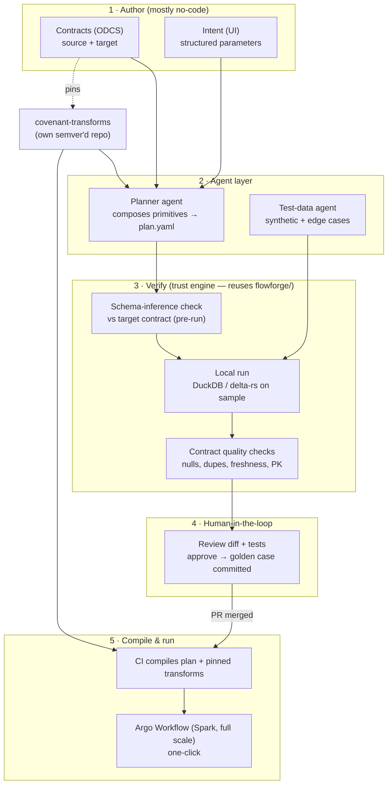

# Covenant — Vision & Architecture

> **Status: MVP built (Slices 0–3).** The trust core is implemented and tested:
> `covenant-transforms/` (the Ibis primitive library) and `covenant/` (ODCS
> contracts, planner with schema-inference conformance, synthetic test data,
> local DuckDB verify, Argo/Spark compile, CLI, and a workbench UI). Backend
> lowering decision **locked to Ibis**. What is *not* built: a live Spark/Argo
> cluster run and an LLM-backed planner — both are clean interfaces with
> deterministic defaults (see §10). Run `covenant demo` or `covenant serve`.

## 1. The problem

Building a data pipeline today is slow and manual: define a schema, ingest data,
hand-write ETL, orchestrate it (Airflow DAGs in Python), then serve it. Most of
the time goes into writing and *trusting* transformation code, and into the rot
that follows — schema drift, backfills, late data, idempotency.

## 2. The vision

**Covenant** turns pipeline authoring into a contract-first, mostly-no-code flow
where an agent writes the transformation code and you can trust it enough to run
it on one click — because Covenant **verifies the pipeline against a data
contract before any production data moves.**

Define a **source contract** and a **target contract** (ODCS). Describe the
pipeline as **structured intent** in a UI. An agent composes it from a library of
typed, tested transform primitives. Covenant checks the result against the target
contract — statically, then on sampled and synthetic data locally — and only then
compiles it to an Argo Workflow you run at full scale.

## 3. What makes it defensible (the wedge)

The market will have "AI writes your pipeline" everywhere within a year. That is a
feature, not a moat. **The defensible value is trust: making an agent-generated
pipeline safe enough to click "run" on production data.** Covenant sells the
*verify-before-run loop*, not the code generation. Two things make trust real:

1. **Schema inference at plan time.** Every primitive can compute its output
   schema from its inputs and parameters *without running*. Chaining them lets
   Covenant say *"this plan produces a schema that violates your target
   contract"* **before any data moves** — contract conformance becomes a
   compile-time check, not just a post-run test.
2. **Local verify that predicts the full run.** The pipeline runs on
   DuckDB/`delta-rs` over a sample + synthetic edge cases locally, checked against
   the target contract's quality rules, before it ever reaches Spark.

## 4. Architecture

Five layers. The bottom two already exist in prototype (`flowforge/`) and are
reused as the verify engine.



**Control plane vs execution plane:** Covenant owns authoring, contracts,
verification, and compilation. It does **not** reimplement a scheduler — Spark on
Argo runs the workload. Local verification uses DuckDB/`delta-rs` for a fast,
cheap trust loop that predicts the Spark run because both lower from the same
primitive definitions.

## 5. Decisions locked

| Area | Decision |
|---|---|
| Product name | **Covenant** — the contract is the hero |
| Contracts | **ODCS** format; separate **source** and **target** contracts; authored in UI |
| Contract UI reference | datacontract-manager-ce (as a UX reference, not a dependency) |
| Change flow | **GitOps** — every UI edit is a branch + **pull request**, gated by CODEOWNERS |
| Source of truth | contracts / intents / plans / tests committed; **Argo/Airflow artifacts are NOT committed — CI compiles them** |
| Primitive library | **`covenant-transforms`** — its own **semver-versioned repo**; contracts pin a version for reproducibility |
| Verify engine | **DuckDB / `delta-rs` local** (sample + synthetic) + **Spark full-scale** |
| v1 scope | **S3 Delta → S3 Delta** (warehouse-shaped) transformations, batch |

## 6. Repository structure (contracts repo)

Split by **concern**, not by data product, so each directory has its own owners
and review cadence. A shared `<domain>/<data-product>/` path slug links a
product's four artifacts across the trees.

```
covenant-contracts/                     # GitOps source of truth
  contracts/<domain>/<data-product>/
      source.odcs.yaml
      target.odcs.yaml                  # the verifier's oracle
  intents/<domain>/<data-product>/
      pipeline.intent.yaml              # structured no-code intent from the UI
  plans/<domain>/<data-product>/
      pipeline.plan.yaml                # agent plan, human-approved, deterministic to re-run
  tests/<domain>/<data-product>/
      golden/                           # human-verified cases (compounding moat)
      fixtures/                         # test-data-agent output
  CODEOWNERS                            # per-directory ownership
  .covenant/config.yaml

covenant-transforms/                    # SEPARATE semver'd repo — the core library
```

## 7. The core: `covenant-transforms`

The primitive library is the core asset. **A primitive is a declarative spec, not
code:** `id@semver`, JSON-schema'd parameters, typed input port(s), and a
**schema-inference function** (input schema + params → output schema, computed
statically). It does **not** embed one Spark implementation and one DuckDB
implementation.

**Dual-backend lowering (locked: Ibis).** Primitives lower through a single
expression layer to both backends via **[Ibis](https://ibis-project.org)**, which
compiles the same expression to DuckDB *and* Spark — so the local verdict actually
predicts the Spark run, and we avoid maintaining two hand-written engines that
drift apart. Delta-specific I/O and `scd2` are wrapped by us at the edges. This
choice is implemented in `covenant-transforms/`.

**v1 primitive set (S3 Delta → Delta):**
`read_delta`, `write_delta`, `cast`, `select`, `rename`, `filter`,
`with_column` (over a **constrained, analyzable expression grammar** — not
arbitrary Python), `join`, `aggregate`, `dedup`, `union`, `window`, and `scd2`
(the high-value primitive hand-pipelines routinely get wrong). Custom-code escape
hatches are allowed but flagged and test-gated.

**Versioning.** Semver; each primitive ships with unit tests + golden fixtures in
the library repo; contracts pin a `covenant-transforms` version, so a pipeline
built today stays reproducible when the library advances.

## 8. Verify layer & human-in-the-loop

- **Test-data agent** generates a Delta fixture: rows conforming to the source
  contract plus deliberate edge cases (nulls, duplicates, boundary types).
- **Smoke tests** run the plan locally and assert the output satisfies the target
  contract (schema + quality rules: PK uniqueness, null thresholds, freshness).
- **Human-in-the-loop UI** shows the generated plan, the tests, and expected vs
  actual output; on approval the case is committed as a **golden test**, so trust
  compounds over time.
- Only a green, human-approved pipeline is eligible for the one-click Argo run.

## 9. Delivery plan — prove the moat first

Sequenced so the defensible core lands before the flashy parts, reusing the
existing verify substrate.

| Slice | Delivers | Proves |
|---|---|---|
| **0 — Trust engine** | hand-written intent → plan → **schema-inference conformance** → test-data agent → local DuckDB/`delta-rs` run → contract verdict. No agent, no UI. | the thing no one else has |
| **1 — Planner agent** | intent → plan automatically, self-correcting against Slice 0's verifier | agent + verifier > agent alone |
| **2 — UI + GitOps** | contract & intent UI writing via PR; golden case on approval | no-code authoring, reviewable |
| **3 — Compile & run** | CI compiles plan → Argo (Spark); one-click run | full scale, one click |

**Fundable demo = Slice 0 + 1:** a data engineer takes a real S3 Delta table to a
new contract-conformant table in ~10 minutes and *trusts the green check*.

## 10. What is built vs. deferred

**Built and tested (this PR):**

| Slice | Status | Where |
|---|---|---|
| Primitive library (Ibis) | ✅ 6 tests | `covenant-transforms/` |
| 0 — trust engine (contracts → plan → schema-inference conformance → test data → local DuckDB verify) | ✅ 7 tests, incl. a static-passes/dynamic-catches case | `covenant/{odcs,planner,testdata,verify}.py` |
| 1 — planner from intent | ✅ deterministic planner + pluggable `Planner` interface | `covenant/planner.py` |
| 2 — UI + GitOps write | ✅ workbench UI, `covenant serve`, plan write for PR | `covenant/{server,webui,gitops}.py` |
| 3 — compile to Argo/Spark | ✅ artifact generation (safe YAML), refuses non-conformant plans | `covenant/compile.py` |

Run it: `covenant demo` (end-to-end incl. the failure case) or `covenant serve`.

**Deferred (clean interfaces, deterministic defaults today — not faked):**

1. **LLM-backed planner.** The `Planner` interface lets an agent *propose* steps;
   they are validated by the exact same conformance + verify path, so an agent can
   never emit an unverified plan. v1 ships the deterministic planner.
2. **Live Spark/Argo run.** We *generate* the Argo/Spark artifact deterministically;
   submitting it needs a Spark + Argo cluster (out of scope for local verify).
   Because both backends lower from the same primitives, the local DuckDB verdict
   predicts the Spark run.
3. **`scd2` / `window` primitives and Delta-native incremental I/O** — roadmap.

## 11. Relationship to the existing repo

The current `flowforge/` package (canonical IR, validation, real local execution,
SQLite event store) is **not discarded** — it is the Slice-0 verify engine. The
"portable compiler to many orchestrators" framing is superseded by this
contract-first, single-stack (S3 Delta → Delta, Spark on Argo) direction. See
[../architecture/DECISION_LOG.md](../architecture/DECISION_LOG.md) for the prior
decisions this builds on.
